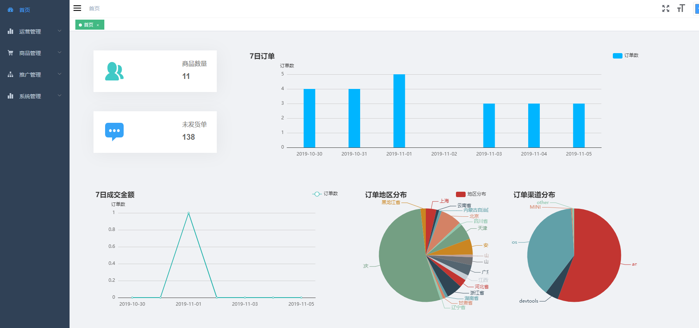
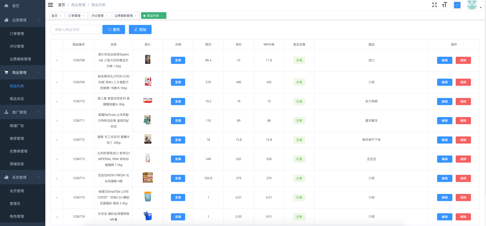
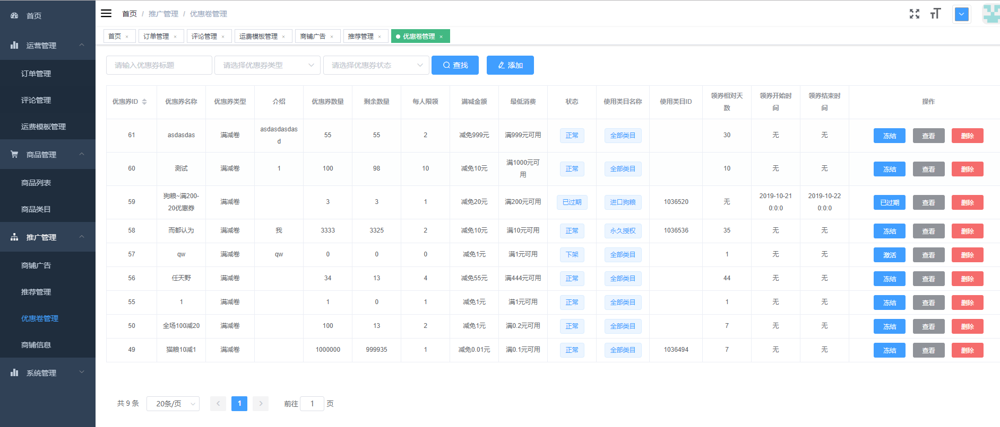
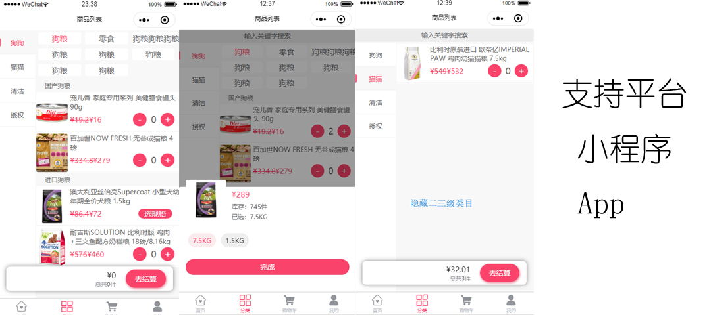
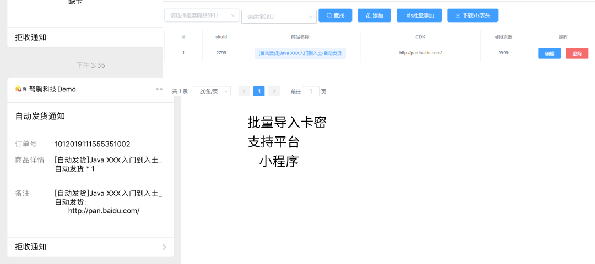
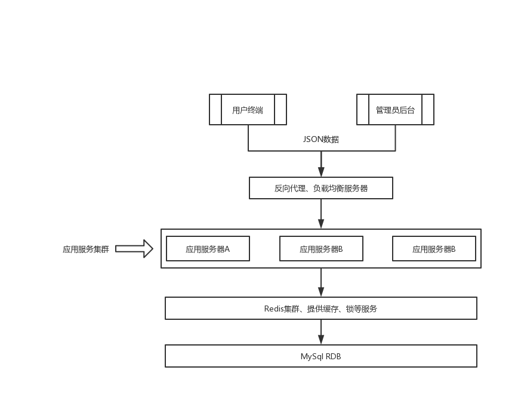

> unimall 针对中小商户、企业和个人学习者开发。
使用Java编码，采用SpringBoot、Mybatis-Plus等易用框架，
作为前端角色，改造打包，一键启用，简单生成api ，电商后台页面
会逐步以前端角色剖析 介入这个后端代码
目前实现：
准备工作： mysql redis  云服务器 maven idea jdk  Navicat premium Redis Desktop Manager
npm webstorm 一切就绪 可以进行以下步骤
1.搭建已运行，可以自定义传入token实现接入api（也以node方式已实现了api，可参考另一个项目）
2. aliyun oss文件上传 已实现 (去ailiyun申请oss 把key值替换即可
[去ailiyun申请oss 把key值替换即可](https://www.aliyun.com/product/oss?spm=5176.12825654.1kquk9v2l.2.e9392c4alUqqON&aly_as=6JY_cFKf&userCode=278cm52d) 
3.短信实现 就可以通过此界面随时给用户发送短信了只是有限制（3个月内，开通一年需要几百块）登陆 12**56**ei
8f7cadbd6d3e1c2607f098fffadbb1d9    admin123***   e5b5cc5c7f5cf687633ae19cfae9fa00
4. 登陆验证码可以自动屏蔽（根据规则） 代码 admin_msg_code_手机号码 值
5.新增加一个增删改实例
...
6. 修改info文档弄成 yapi形式  修改页面  （扩展 api样式） 
7. 打包jar包 把服务跑起来
进入unimall项目根目录，执行
mvn package -Dmaven.test.skip=true
跑起来 nohup java -jar unimall-launcher-0.0.1-RELEASE.jar --spring.profiles.active=prd >/dev/null &
查看端口占用：  netstat -tunlp |grep 8085
先kill掉8085端口运行的java进程.  kill -9 进程号

8 用一个简单表格做上增删改查  和那个发送短信例子 只开放给一个用户使用 testTable
不需要登陆  针对某个菜单 goods getGoodsPage 
和需要登陆才能查询

和需要登陆放开得权限   operation:order:list  测试这个权限

9.admin 放入ngnix
10. 做一个任意表的增删改查支持我的多项功能测试( 参照 api.goods.AdminGoodsServiceImpl 写的 AnyAttrService 服务类)
11. http://localhost:8085/m.api?_gp=admin.anyattr&_mt=getList&id=1&type=2
11..1 http://localhost:8085/m.api?_gp=admin.anyattr&_mt=updateObj&anyAttrDTO={"id":1,"attr1":"66666666","attr2":"555555"} post请求方式
11..2 http://localhost:8085/m.api?_gp=admin.anyattr&_mt=insertObj&anyAttrDTO={"id":1,"attr1":"66666666","attr2":"555555"}
11..3 http://localhost:8085/m.api?_gp=admin.anyattr&_mt=delById&aid=5f89f82f-d695-4fde-a167-6f73c6cb1a18
11..4 http://localhost:8085/m.api?_gp=admin&_mt=login&username=guest&password=123456&verifyCode=666666 post请求方式
12.增加频繁提交限制
13.短信验证 先暂时去掉
14修改admin和guest密码一样
15.unimall 后台运营管理服务加pc端运营界面和角色 view-ui ui界面 app手机端 
16.代码生成或者通过webstorm或者idea 自动生成 两种方式
...
1.单独启动某一个模块

还未搞定：
1.微信小程序 APP H5  微信付款
    短信sdk配置（阿里云短信开通 可测试
      [阿里云短信开通 可测试](https://www.aliyun.com/product/sms?spm=5176.12825654.1kquk9v2l.1.e9392c4a3JE2uq&aly_as=MQVh4Aoe&userCode=278cm52d)
     国内通用短信套餐包 4.5/月  3元起，仅可用于国内文本短信，不包括国际及港澳台消息服务
     （可以自定义3个月，玩转短信服务模板配置）
     顺便可以支持 阿里云推荐返现计划
     快递查询
     语音服务（Voice Messaging Service）
     添加 [智能语音交互](https://ai.aliyun.com/nls?spm=5176.13203013.j64pehhhs.81.2e4331f9DnYDBU&aly_as=02h9bY-Z)
     添加 [DataV数据可视化](https://data.aliyun.com/visual/datav?spm=5176.13203013.j64pehhhs.77.2e4331f9DnYDBU&aly_as=F56_QD6v)
    增加图形校验码。使用成熟的图形验证产品
    IP地址限制。在服务器端增加对单ip请求的验证码数量进行限制
    手机号码限制。客户在服务器端对单手机号请求的验证码数量进行限制

    群发短信

- 后台演示地址: [http://admin.unimall.iotechn.com](http://admin.unimall.iotechn.com)
- 登录名:guest   密码:123456   验证码:666666 (guest仅有只读权限)

#### 插件中心

Unimall主程序功能均项目中，包括其基本的订单、商品、广告、优惠券、运费模板、VIP等等功能。后续功能将以插件的形式陆续提供。插件使用主程序模板方法的形式实现。具有自动安装的功能，尽量减少对主代码入侵。插件并无太多学习价值，所以仅对授权用户开放，并且每个插件单独收费。

**1.点餐列表**   部分开发者也许需要点餐列表，用于外卖、社区超市、生鲜线下配送等场景。

**2.自动发货**  部分商家售卖虚拟物品，例如话费、网游充值卡。自创作视频教程等。使用自动发货插件可自动将卡密发送到用户微信上。

更多插件，敬请期待！

#### Unimall 基本框架

Unimall使用前后分离的设计、后端采用Java编写，前端均适用vuejs编写。

#### 项目部署方式

>项目部署

##### ⓪ 服务器推荐
服务器可根据自身业务来选购，单机环境推荐2C4G

##### ① 基础运行环境

| 运行环境 | 版本号 |
|:--------|:--------|
|  MySQL   |  5.7（推荐）   |
|  JDK   |  1.8（推荐）   |
|  Redis   |  4.0.1（其他也可以）   |
|  Nginx  |  只要Web容器就可以了  |

请参考 [CentOS7.4 安装 MySQL5.7](https://github.com/iotechn/document-basic/blob/master/CentOS7.4_Install_MySQL5.7.md)

请参考 [CentOS 安装 JDK8](https://github.com/iotechn/document-basic/blob/master/CentOS_Install_JDK8.md)

请参照CentOS [安装 NodeJs 8.15.0](https://github.com/iotechn/document-basic/blob/master/CentOS_Install_NodeJS_8.15.0.md)

Redis安装可直接使用yum安装 
	
	yum install redis

安装完成后使用 redis-cli 命令，若能进入，则表示redis安装完成

##### ② 后台管理系统编译运行指南

[编译运行指南](doc/run.md)

##### ③ 编译部署前后端代码

项目部署分为 Server 、 App 、 Admin 三个部分

[部署Step1:Java后台编译&部署](doc/server.md)

[部署Step2:App编译打包](doc/app.md)

[部署Step3:Admin编译打包](doc/admin.md)

##### ④ 二次开发文档

[二次开发文档](doc/2develop.md)  把二次原装简单写在这里

其中admin-api、app-api、core、data、launcher五个module属于Java工程。

core：包括公用工具、公用注解等，每个项目都会用到 data：存放数据模型，负责数据库访问的封装。
例如mysql、redis等。若需要扩展其他类型数据源，也应该封装到此module api：服务核心逻辑。
分别是app和admin的Api。 launcher：唯一可以启动的SpringBoot包。
它会去扫描其他包下的Bean并且放入其IoC中。并且所有暴露的OpenApiService都注册在launcher中。
launcher负责对请求进行权限鉴定、参数校验、参数转换等。并提供统一的Api调用方式。
同时launcher还负责生成Api文档，提供在线调试工具。

PS：测试环境文档演示：https://XXXX/info/

#### 版权声明  保留了原话

本项目有重庆驽驹科技有限公司开发，禁止未经授权用于商业用途。个人学习可免费使用